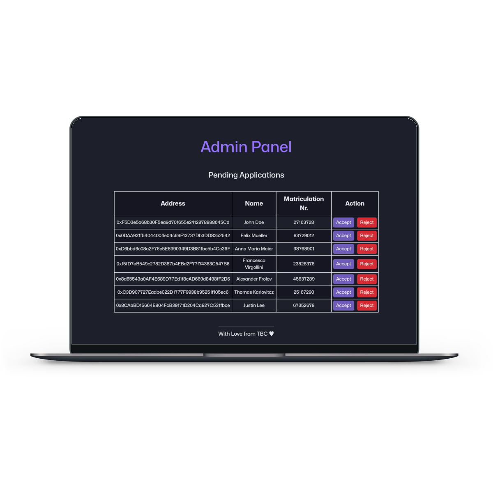

# Near-ly Certified
[ETHPrague](https://ethprague.com/) collaboration repository for the fontend part of the ETH Prague Hackathon Project called Near-ly Certified built on [near](https://near.org/) blockhain.

For the full documentation and pitch of the project, please refer to [Devfolio](https://devfolio.co/projects/nearly-certified-882e).
## Examples
### Web3 Login

### Application Form

### Pending Applications (Admin Panel)

